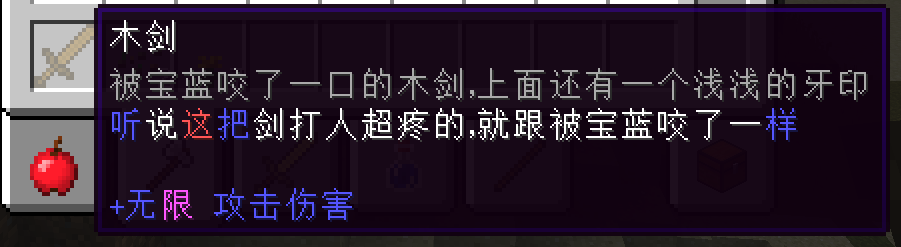

## BiliBili宝蓝狼的泰坦杀手2

[视频地址](https://www.bilibili.com/video/BV19t411V7Sk/?spm_id_from=333.880.my_history.page.click&vd_source=be3bfb135a20a47b0b6d49f912d5d069)



鉴于许多年龄不大的家人一直在评论区被圈钱，所以我花了点小时间把里面的许多功能特性实现了。

遥想还是个中二初中生的时候也喜欢整这一出(不堪回首)。

总之希望少一点人被骗吧。


# 使用

和正常的mod一样，放进mods文件夹就可以用了  

不是病毒，不会锁电脑

实现功能的地方都有注解，因为是Coremod，所以gradle需要配置一下  

发布页的Release中有成品  

# 开发

1.7.10已经被放弃了，包括ForgeGradle在内的大部分插件都已经失效  

本项目最初使用官方SDK构建，目前已更换为[anatawa12/ForgeGradle-1.2](https://github.com/anatawa12/ForgeGradle-1.2)

支持Gradle 8.5版本

## Usage

克隆本项目后，在项目根目录执行:

```bash
./gradlew setupDecompWorkspace
```

使用任一IDE导入本项目即可

运行客户端:

```bash
./gradlew runClient
```

